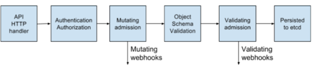

### k8s-webhook

实现一个简单的功能

1、规定pod标签的必须含有app: ture否则不给创建

-----
Webhook就是一种HTTP回调，用于在某种情况下执行某些动作，Webhook不是K8S独有的，很多场景下都可以进行Webhook，比如在提交完代码后调用一个Webhook自动构建docker镜像
本项目只实现在mac电脑下通过minikube创建的集群来debug调试程序。
###文章参考：
https://kubernetes.io/zh/docs/reference/access-authn-authz/extensible-admission-controllers/
https://github.com/phosae/denyenv-validating-admission-webhook/blob/master/outcluster-webhook-configuration.yaml
https://www.jianshu.com/p/a76e8f7d13b7
https://github.com/kubernetes/kubernetes/tree/v1.13.0/test/images/webhook

本项目样例仿照K8s官方提供的webhook例子
https://github.com/kubernetes/kubernetes/tree/v1.13.0/test/images/webhook

### 环境准备
环境系统  macOS Monterey 版本 12.3.1 apple M1 PRO
         goland
         go 1.7
         minikube
         k8s集群 1.23.3

### 集群安装
1.安装minikube模拟
https://www.voidking.com/dev-macos-minikube/

minikube start --image-mirror-country='cn' \
--image-repository="registry.cn-hangzhou.aliyuncs.com/google_containers"  \
--driver=docker \
--kubernetes-version=v1.23.3 

官方只支持webhook配置https访问
# 对于配置为使用 URL 的 webhook，请匹配在 webhook 的 URL 中指定的主机（和端口）。
# 带有 `url: https://www.example.com` 的 webhook：
# - name: www.example.com
#   user: ...
Admission Webhook 本质是 api-server 的一个 webhook 调用，下面是 api-server 的处理流程：

即 api-server需要访问webhook接受服务器  需要通过https    
问题来了 既然api-server需要通过https访问webhook服务器，那么谁颁发证书给webhook服务器。
api-server就是一个ca认证机构
CertificateSigningRequest 对象提供了一种通过提交证书签名请求并异步批准和颁发 x509 证书的机制。

所以webhook服务器只需要使用openssl 生成一个私钥
然后生成一个csr给api-server
api-server会对该csr进行签名然后颁发证书给你

### 
webhook证书生成
#生成RSA私钥(无加密)
openssl genrsa -out server-key.pem 2048

#根据server-key.pem私钥生成证书请求 server.csr
#-new 指生成证书请求、req是证书请求的子命令、-subj自动输入
openssl req -new -key server-key.pem -subj "/CN=host.minikube.internal" -out server.csr -config csr.conf

#create  server cert/key CSR and  send to k8s API
#CertificateSigningRequest 对象提供了一种通过提交证书签名请求并异步批准和颁发 x509 证书的机制。用api-server的CA进行签发

cat <<EOF | kubectl create -f -
apiVersion: certificates.k8s.io/v1
kind: CertificateSigningRequest
metadata:
name: webhook-test
spec:
groups:
- system:authenticated
  request: $(cat server.csr | base64 | tr -d '\n')
  signerName: kubernetes.io/kube-apiserver-client
  usages:
- digital signature
- key encipherment
- client auth
  EOF

#批准 kubectl certificate approve  webhook-test

#将服务私钥和证书，存储到 Kubernetes Secret 中 获取生成的证书
kubectl get csr webhook-test -o jsonpath='{.status.certificate}' | openssl base64 -d -A -out server-cert.pem

# create the secret with CA cert and server cert/key
kubectl create secret tls webhook-test \
--key="server-key.pem" \
--cert="server-cert.pem" \
--dry-run=client -o yaml |
kubectl  apply -f 

##获取api-server的证书
kubectl -n kube-public get cm kube-root-ca.crt -o jsonpath={.data.'ca\.crt'} | base64 | tr -d '\n'

	kubectl get secret denyenv-tls-secret -o jsonpath={.data.'tls\.crt'} | base64 -d > tls.crt
	kubectl get secret denyenv-tls-secret  -o jsonpath={.data.'tls\.key'} | base64 -d > tls.key

	kubectl delete secret denyenv-tls-secret
	kubectl delete -f output-test.yaml
	kubectl delete CertificateSigningRequest denyenv.default